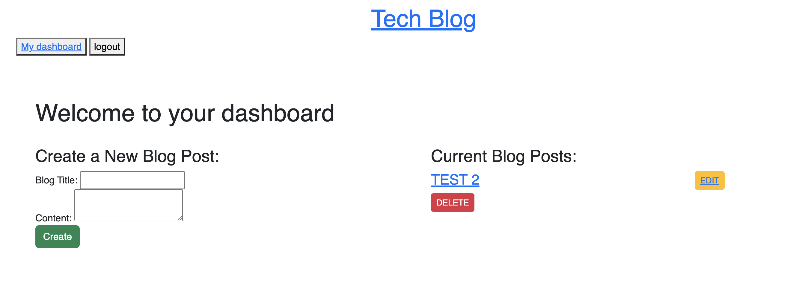

# MVC_Challenge-Tech-Blog

## Table of Contents
- [Project description](#Description)
- [Usage](#Usage)
- [Installation](#Installation)
- [Contributions](#Contributions)

## Description
This assignment requires building a CMS-style blog site where developers can publish their blog posts and comment on other developers’ posts.

## Usage
Using the heroku link, you can access the tech blog page to create edit and delete posts as well as leave comments.

https://pacific-badlands-98451.herokuapp.com/ 

## Installation
express, dotenv, node.js, sequelize, msql2, bcrypt, express-session, express-handlebars, handlebars & connect-seesion-sequelize

## Contributions
UCF TA's and fellow classmates.

